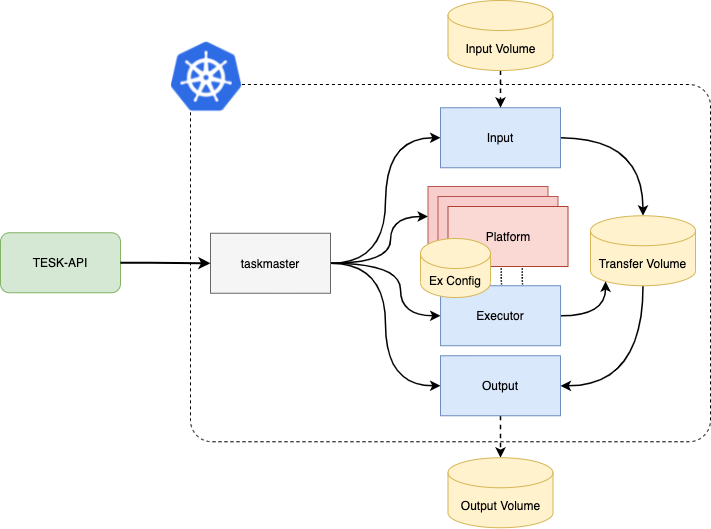

# README

This is the repository of the PLAS extension based on TESK. For the official documentation head over the [TESK repository](https://github.com/elixir-cloud-aai/TESK).

We recall the official TESK requirements:
- A working Kubernetes cluster version 1.9 and later.
- If you want TESK to handle tasks with I/O (and you probably want), you additionally need:
- A default storage class, which TESK will use to create temporary PVCs. It is enough that the storage class supports the RWO mode.
- And, if you want TESK to integrate with workflow managers, you additionally need either an FTP account or a PVC that can be accessed from within or from outside of the cluster by the workflow manager (more in the [TESK deployment page](https://github.com/elixir-cloud-aai/TESK/blob/master/documentation/deployment_new.md)).

With the PLAS extention 